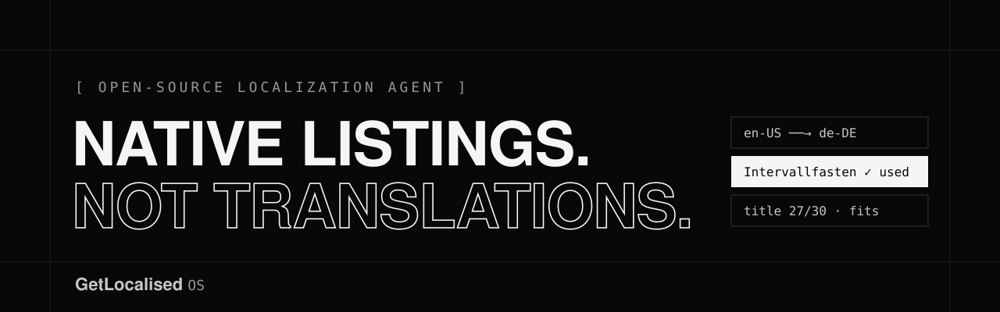

<picture>
  <source media="(prefers-color-scheme: dark)" srcset=".github/assets/banner-dark.svg">
  <source media="(prefers-color-scheme: light)" srcset=".github/assets/banner-light.svg">
  
</picture>

<p>
  <a href="https://dev.getlocalised.com"></a>
  
  
  
  <a href="LICENSE"></a>
</p>

**GetLocalised OS** is an open-source localization agent for mobile app store listings. Give it an English Google Play listing and a market, and it writes a **native** listing: the same meaning and promises, in the words people in that market actually search with. It is shaped by **skills**, plain Markdown files you can read, edit and version with your code.

> **Try it:** [dev.getlocalised.com](https://dev.getlocalised.com) — no sign-up and no key. Pick an example app and a market, type `/` in a field, and reshape it with a command.

---

## Contents

- [What it does](#what-it-does)
- [Quick start](#quick-start)
- [Local run](#local-run)
- [How it works](#how-it-works)
- [What it doesn't do](#what-it-doesnt-do)
- [Project layout](#project-layout)
- [Regenerating the example data](#regenerating-the-example-data)
- [Prior work disclosure](#prior-work-disclosure)
- [License](#license)

## What it does

| | |
| --- | --- |
| **Native, not translated** | Rewrites title, short description and full description the way a local copywriter would, keeping every fact and promise from the source. |
| **Skills you can read** | Brand, audience and store rules live in Markdown. The agent follows them, and so can you. |
| **Real search phrases** | Uses Google Play's own search suggestions for each market, captured and dated, to choose natural local wording. |
| **Checked against the store** | Every field is counted against Play's limits; phrase usage, repeated words and over-limit fields are flagged. |
| **Commands with previews** | Sound native, Search terms, Punchier, Lead with the benefit, Fit the limit, and more. Each shows a preview before anything changes. |
| **Your key, your machine** | Runs with your own Gemini or OpenAI key, in the Playground or locally. Keys are never stored. |

## Quick start

```bash
git clone https://github.com/Motlakz/getlocalised-os
cd getlocalised-os
bun install
bun dev          # http://localhost:3000 and http://localhost:3000/playground
```

The Playground works immediately with no key. It ships with three real example apps (AuraSage, BellyClock and Love Tester AI) in French, Spanish and German. To run commands live, paste a Gemini or OpenAI key into the Playground's key control. It is sent with each request to this app's own server, used once, and never stored or logged.

## Local run

The same engine runs from the command line with your own key:

```bash
cp .env.example .env.local        # then set GEMINI_API_KEY=… (or OPENAI_API_KEY=…)

bun run localize --app bellyclock --to de-DE                          # native listing + notes
bun run localize --app bellyclock --to es-ES --command punchier --field short
bun run localize --listing my-listing.json --to fr-FR                 # your own listing
bun run localize --app aurasage --to fr-FR --provider openai          # use OpenAI instead
```

`my-listing.json` is `{ "title": "…", "short": "…", "full": "…" }`. Your own listings use the generic skills in `data/default-skills/`; copy and edit them to teach the agent about your app.

## How it works

```
English listing ─┐
Market phrases  ─┼─▶  engine (lib/engine)  ─▶  native listing + “why this term” notes
Skills + command ┘          │                          │
                     Gemini / OpenAI            findings (lib/findings): limits,
                     (your key)                 phrase usage, repetition
```

- **Skills** (`data/examples/<app>/skills/*.md`) are `SKILL.md`-style files with `name` and `description` frontmatter. They go into the prompt verbatim and override the engine's defaults.
- **Commands** (`lib/engine/commands.ts`) are one short instruction each. They run on one field at a time and return previews; nothing is applied until you pick one.
- **Findings** are deterministic, run in the browser, and update as you type. No model is involved and nothing is scored.
- **The Playground** reads prepared results from `data/examples` (static pages, no key), and calls `/api/rewrite` or `/api/localize` when you add a key.
- **Honesty checks:** the engine retries once when a field breaks its limit or a note claims search volume it cannot know, then drops any such note. `bun run validate` fails on either.

## What it doesn't do

- It doesn't measure or estimate search volume, rankings or competition. Wording comes from the model plus your skills and real search suggestions.
- It doesn't upload to or connect with Google Play Console. Copy or export, then paste.
- It doesn't store keys, listings or accounts.

## Project layout

```
app/
  page.tsx                          landing page (dev.getlocalised.com)
  playground/[app]/[market]/        one static Playground page per example app × market
  api/rewrite, api/localize         live runs with the visitor's key
components/
  landing/                          hero replay and docs sections
  playground/                       compare view, / command menu, skills panel, key control
lib/
  engine/                           prompts, commands, providers, localizeListing / rewriteField
  findings/                         limits, phrase usage, repetition (+ tests)
data/
  examples/<app>/                   listing.json, <market>.json, skills/*.md
  default-skills/                   generic skills for your own listings
scripts/
  capture.ts, localize.ts, validate.ts
devpost/                            scope, PRD, spec and build checklist for the hackathon
```

Checks: `bun run typecheck`, `bun run lint`, `bun test`, `bun run validate`.

## Regenerating the example data

The Playground's data was generated by this repo's own engine and committed, so the demo needs no key and can't break when a service changes.

```bash
bun run capture                       # real Play listings + Play search suggestions (build time only)
bun run localize --seed               # native listings + every prepared command, resumable
bun run localize --seed --force --app bellyclock --to fr-FR   # regenerate one market
bun run validate                      # completeness, limits, no demand claims
```

`capture` uses [`google-play-scraper`](https://github.com/facundoolano/google-play-scraper), read-only and only at build time; the deployed app never calls Google Play. Each page shows which model generated it and when.

## Built for

Devpost's **Build With AI: Basics** (submission period 2026-09-22 → 2026-10-26). The scope, product requirements, technical spec and build checklist written with the course's skill pack are in [`devpost/`](devpost/).

## Prior work disclosure

This repository was created on **2026-09-27**, inside the submission period. Everything in it was written during that period except the items below, which are disclosed as required by the rules.

| Incorporated | Source | Notes |
| --- | --- | --- |
| Next.js app scaffold (configs, `AGENTS.md`, `CLAUDE.md`) | `create-next-app` 16.3.6 | Standard development tooling; the app files have since been rewritten |
| shadcn/ui primitives (`components/ui/`) | [shadcn/ui](https://ui.shadcn.com) CLI | Generated components (button, popover, command, dialog, tabs…) |
| Build With AI: Basics skill pack (`.claude/skills`, `skills-lock.json`) | [challengepost/learn-ai-basics](https://github.com/challengepost/learn-ai-basics) | Course material, installed for Claude Code |
| Design tokens and typography (`app/globals.css`, fonts) | The author's GetLocalised app ("Slate" design) | Token roles, square corners and the Raleway / Source Sans 3 / Merriweather pairing, recoloured to greyscale |
| Command names and one-line descriptions (`lib/engine/commands.ts`) | The author's GetLocalised app (command palette) | Names and descriptions only; the instructions are written fresh |
| Example app listings and product positioning (`data/examples/`) | The author's own published apps: AuraSage, BellyClock, Love Tester AI | English listings captured from Google Play; skill files written from the author's own product docs |
| Google Play search suggestions (`data/examples/*/<market>.json`) | Google Play, via `google-play-scraper` | Captured once at build time, dated in each file |

**Related work.** The author also builds GetLocalised, a separate commercial product for app store localization (started 2026-09-26). Apart from the design tokens and command names listed above, no source code, prompts, data or assets from it are included in this repository. Some UI patterns (side-by-side compare, a `/` command palette with previews, a timed hero replay) follow the same ideas but were implemented fresh here.

Keep this section current: add a row whenever pre-existing code, assets or third-party work is incorporated.

## License

[MIT](LICENSE) © 2026 Motlakz. The example app listings and brand content in `data/examples/` describe the author's own apps and are included as examples.
